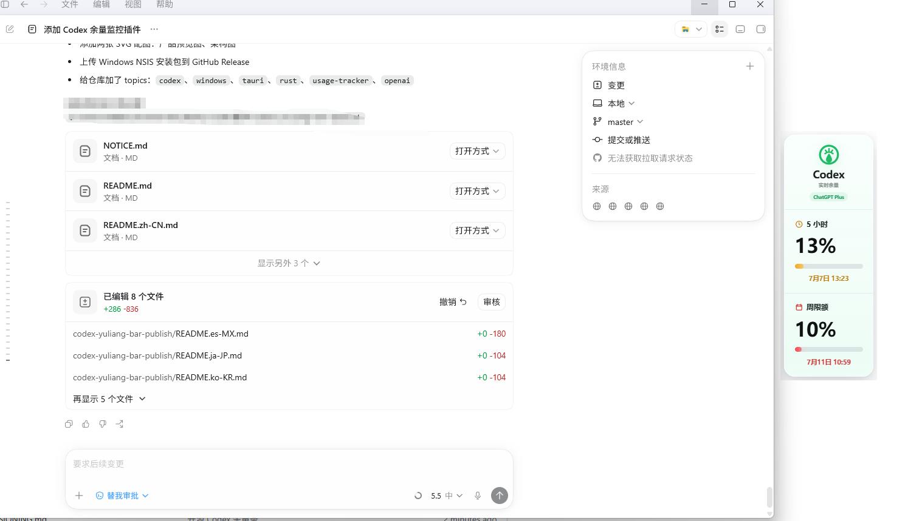

# Codex 余量条

> 贴在 Codex Desktop 右侧的 Windows 余量提醒工具。

<p align="center">
  
</p>

Codex 余量条会在 Codex Desktop 处于前台时自动吸附到右侧，显示 5 小时会话余量和周限额余量。它基于 [Finesssee/Win-CodexBar](https://github.com/Finesssee/Win-CodexBar) 改造，并保留 [CodexBar](https://github.com/steipete/CodexBar) 的 provider 思路。

## 特性

- 只显示 Codex 内容。
- 自动吸附 Codex Desktop 右侧。
- Codex 失焦、最小化或关闭时自动隐藏。
- 展示 5 小时窗口和周限额。
- 中文界面，默认显示剩余额度。
- 本地运行，不上传聊天内容、token 或账号数据。

## 安装

从 GitHub Releases 下载：

```text
Codex 余量条_<version>_x64-setup.exe
```

安装后启动 **Codex 余量条**，再打开 Codex Desktop。

## 开发

```powershell
cd apps/desktop-tauri
pnpm install
pnpm run build
cd ..\..
cargo check
```

打包安装器：

```powershell
cd apps/desktop-tauri
pnpm exec tauri build --bundles nsis
```

## 隐私

本工具默认本地运行，不上传聊天内容，不主动记录 token，不把敏感凭证写入 UI 或日志。

## 免责声明

本项目不是 OpenAI 官方产品，也不隶属于 OpenAI。Codex、OpenAI 等名称归其各自所有者所有。

## 协议

MIT。请保留上游项目署名。
